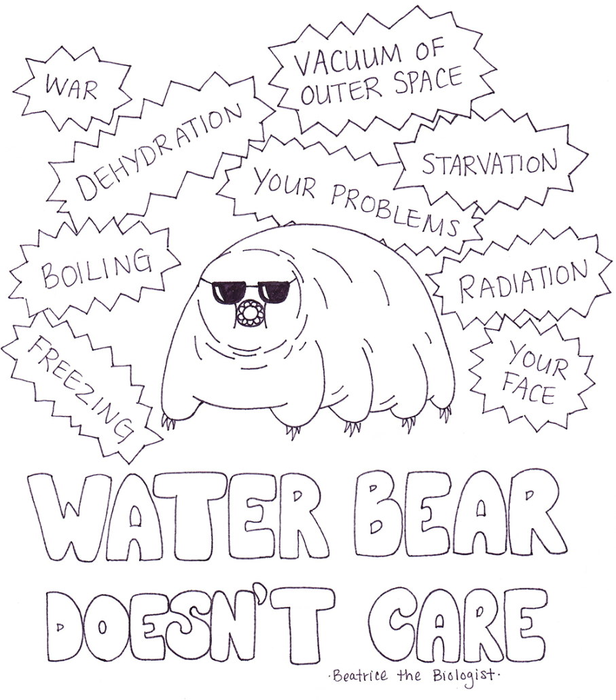

# Tardigrades
Gene prediction, functional annotation, protein localization

### Tardigrades: from genestealers to space marines 
Tardigrades (also known as water bears, pudgy wudgies, or moss piglets) are microscopic animals capable of withstanding some of the most severe environmental conditions. These water-dwelling, eight-legged creatures can be found throughout the world, from the Himalayas (above 20,000 ft), to the deep sea (below 13,000 ft). Classified as “extremophiles”, they can survive freezing (up to 1°K), total dehydration, pressure (more than 1,200 atmospheres) and radiation (1,000 times more radiation than other animals).   
  
Tardigrades are the first known animal to survive in space. In September 2007, dehydrated tardigrades were taken into low Earth orbit, and exposed to the hard vacuum of outer space and solar UV radiation (the project was called “Tardigrades In Space”, or TARDIS). 
   
For a long time researchers tried to understand how these creatures can be so stress-tolerant. They tried to explain radiation withstand with the fact that they are able to enter the dehydrated state (and survive in up to five years), and this state provides fewer reactants for ionizing radiation. But later it was shown that when hydrated, they still remain highly resistant to shortwave UV radiation in comparison to other animals. 
  
It means that they can efficiently repair damage to their DNA. But how?! It was a mystery until 2016, when the scientists were able to sequence the genome of Ramazzottius varieornatus, one of the most stress-tolerant species of Tardigrades. In this project we will try to analyze this genome and understand this secret. 
 
So, let's figure out why they are so cool
