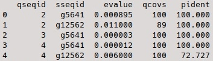

# Tardigrades: labjournal

## 0. Obtaining data
```bash
wget http://kumamushi.org/data/YOKOZUNA-1.scaffolds.fa
```
I renamed the file "tardigrade.fa"

## 4. Functional annotation 
I used https://github.com/tejashree1modak/AUGUSTUS-helpers to obtain protein coding sequences
```bash
bash get-fasta.sh augustus.whole.gff
```
Then I counted the number of sequences:
```bash
grep -c ">" protein.fasta
```
The output: 16435

## 5. Physical localization
peplides.fa is a file containing list of peptides that were associated with the DNA. The data is obtained from tandem mass spectrometry experiments using chromatin fraction. <br>
### Creating blast database and doing a local blast search:
Creating database:
```bash
makeblastdb -in protein.fasta -dbtype prot -out proteins_db
```
Running blastp:
```bash 
blastp -query peptides.fa   -db proteins_db  -out proteins.blastp -outfmt "6 qseqid sseqid evalue qcovs pident" -evalue 0.05  -task blastp-short

```
So we have proteins.blastp file. Using a python script phys_loc.py. It can be found in ./scripts.<br>
The head of the table:<br>
 <br>
There are 44 proteins in it<br>

### Extracting protein sequences
I created the script extract_seq.py to do this. It can be found in ./scripts. The script creates file protein_1.fasta with the extracted sequences<br>
```bash
grep -c ">" protein_1.fasta
```
The output is 15. There are 15 extracted sequences

## 6. Localization prediction
### WoLF PSORT
Protein Subcellular Localization Prediction https://wolfpsort.hgc.jp/ <br>
The results:<br>
<br>
g4106 details E.R.: 14.5, E.R._golg: 9.5, extr: 7, golg: 3.5, lyso: 3, pero: 2, plas: 1, mito: 1 g5237 details plas: 24, mito: 8 g5467 details extr: 27, plas: 4, mito: 1 g5502 details extr: 31, lyso: 1 g5503 details extr: 29, plas: 1, mito: 1, lyso: 1 g5510 details plas: 23, mito: 7, E.R.: 1, golg: 1 g5616 details extr: 31, mito: 1 g5641 details extr: 31, lyso: 1 g10513 details nucl: 20, cyto_nucl: 14.5, cyto: 7, extr: 3, E.R.: 1, golg: 1 g12510 details plas: 29, cyto: 3 g12562 details extr: 30, lyso: 2 g13530 details extr: 13, nucl: 6.5, lyso: 5, cyto_nucl: 4.5, plas: 3, E.R.: 3, cyto: 1.5 g14472 details nucl: 28, plas: 2, cyto: 1, cysk: 1 g15153 details extr: 32
g15484 details nucl: 17.5, cyto_nucl: 15.3333, cyto: 12, cyto_mito: 6.83333, plas: 1, golg: 1

